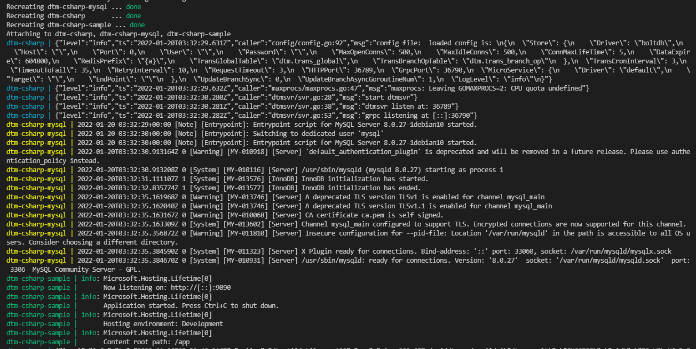

# dtmcli-csharp-sample
dtmcli c# 使用示例

## 快速开始

### 部署启动dtm
需要docker版本20.04以上
```
git clone https://github.com/dtm-labs/dtm
cd dtm && git checkout v1.10.0
docker-compose up
```

### 启动示例
```
cd DtmSample
dotnet run DtmSample.csproj
```

这个时候通过浏览器打开 `http://localhost:9090` 会跳转到 swagger 页面，可以选择性的测试对应类型的事务模式。

> 根据情况，调整一下 `appsettins.json` 文件，换成对应的配置值之后，再运行示例。

### 其他

当然，您也可以通过执行 `runsample.ps1` 来快速运行示例代码。

它会通过 **docker-compose** 启动 dtm，mysql(演示子事务屏障)，dtmsample

启动后，可以看到类似下面的输出


